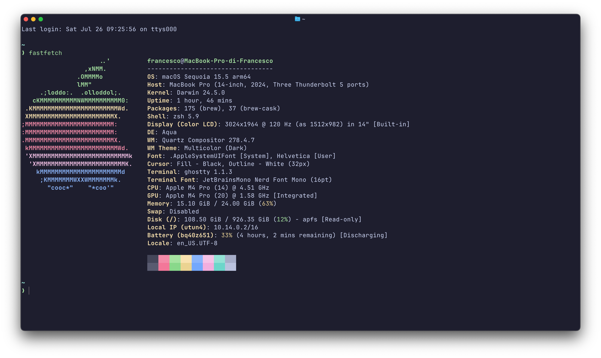

---

## 📁 ***My Dotfiles***

Personal configurations for a modern, productive, and minimal shell.
Meant to be used with my **.zshrc** on macOS.
This repository contains the configuration files I use daily on macOS/Linux, including:

- ⚡ **Zsh** with custom plugins and prompt, managed by Zinit
- 📝 **Neovim** as my favourite editor within the terminal
- 🪞 **Ghostty** as terminal emulator
- 🛠️ Other CLI tools (SDKMAN, fnm, Starship, etc.)
- 🍺 **Homebrew** package management via `Brewfile`  **([Homebrew Bundle, brew bundle and Brewfile](https://docs.brew.sh/Brew-Bundle-and-Brewfile))**

---

## 📸 **Terminal Preview**



---

## 🗂 **Repository Structure**

```bash
.config/
├── aerospace/               # Aerospace tiling manager configuration
├── ghostty/              # Ghostty terminal config
├── nvim/                 # Neovim config
├── starship/             # Starship prompt config
├── yazi/                 # yazi terminal file explorer config
├── zsh/                  # Zsh configuration
Brewfile                  # Homebrew package list for Brew Bundle
```

---

## 🚀 **Quick Setup**

### Prerequisites

Make sure you have installed:
- **Git**
- **Zsh**
- **Homebrew** (on macOS) or an equivalent package manager
- **GNU Stow** for dotfile management

### **Installation Steps**

1. Clone your dotfiles repository into a folder in your home directory:

    ```bash
    git clone https://github.com/fraluc06/dotfiles.git ~/.dotfiles
    ```
    or via SSH:

    ```bash
    git clone git@github.com:fraluc06/dotfiles.git ~/.dotfiles
    ```
   or via gh CLI:

    ```bash
    gh repo clone git@github.com:fraluc06/dotfiles.git ~/.dotfiles
    ```

2. Change into the dotfiles directory:

    ```bash
    cd ~/.dotfiles
    ```

3. Use **GNU Stow** to symlink your configs automatically:

    ```bash
    stow zsh
    stow nvim
    stow ghostty
    # ...
    ```
    or all with one command

    ```bash
    stow */ # Everything (the '/' ignores the README)
    ```

4. Install all Homebrew packages and casks from your `Brewfile`:

    ```bash
    brew bundle --file=~/dotfiles/Brewfile
    ```

5. Install npm packages from the JSON file (requires `jq`):
    ```bash
    bat npm-global-packages.json | jq -r '.dependencies | keys[]' | xargs npm install -g
    ```

---

## 📦 Exporting Packages

This section explains how to export the package lists for Homebrew and npm.

### Homebrew

To update the `Brewfile` with all currently installed packages, run:

```bash
brew bundle dump --file=./Brewfile --force
```

### NPM

To save a list of globally installed npm packages, run:

```bash
npm ls -g --json > npm-global-packages.json
```

---

## 🐍 **Python Setup for University**

### Install Python with pyenv

Make sure you have `pyenv` and `pyenv-virtualenv` installed (it should be included in the `Brewfile`)
**Tip:** You can check the latest available Python version with:
```bash
pyenv install --list
```
```bash
brew install pyenv
pyenv install 3.13
pyenv global 3.13
```
### Creating the virtual environment for the University
```bash
pyenv virtualenv 3.13 uni-env
pyenv activate uni-env
```
### Installing required packages
```bash
pip install -r ./requirements.txt
```
To make Intellij recognize the virtualenv with the Python plugin, add Python SDK -> Virtualenv Environment -> Existing Environment and select the path to the virtualenv you created, usually something like `~/.pyenv/versions/uni-env/bin/python`.
N.B. If you haven't installed the Python plugin, you can do so from `File -> Settings -> Plugins` and search for "Python". 
If it gives an error saying it can't find the SDK when you try to run a .py file, remember to create a module in `Project Structure -> Modules` and add the path to the virtualenv you created, usually something like `~/.pyenv/versions/uni-env/bin/python`.

## 🧩 **Included Plugins & Tools**

### **Zsh**
- Managed with `Zinit` for optimal plugin loading
- `zsh-autosuggestions`: Dynamic suggestions while typing
- `fzf-tab`: Replace zsh's default completion selection menu with fzf
- `fast-syntax-highlighting`: Syntax highlighting for commands
- `forgit` : A utility tool powered by fzf for using git interactively.

### **Nushell**
___**NOTE: replace `francesco` with your `username`**___

- To set Nushell as default shell, run:

```bash
z Library/LaunchAgents &&
`echo '<?xml version="1.0" encoding="UTF-8"?><!DOCTYPE plist PUBLIC "-//Apple//DTD PLIST 1.0//EN" "http://www.apple.com/DTDs/PropertyList-1.0.dtd"><plist version="1.0">
<dict>
<key>Label</key><string>my.startup.shell_agnostic.environment</string>
<key>ProgramArguments</key><array><string>sh</string><string>-c</string><string>
  launchctl setenv XDG_CONFIG_HOME ~/.config
</string></array>
<key>RunAtLoad</key><true/>
</dict>
</plist>' > ~/Library/LaunchAgents/me.francesco.environment.plist`
```
Then run:
```bash
chsh -s /opt/homebrew/bin/nu
```
and finally reboot your machine.

### **Terminal**
- **Ghostty** with custom themes and fonts:
  - **[Catppuccin Mocha](https://github.com/catppuccin/)**: Catppuccin is a pastel theme with four warm flavors and 26 eye-candy colors, ideal for coding, designing, and other creative tasks.
  - **[JetBrains Mono Nerd Font](https://www.nerdfonts.com/font-downloads)**: A monospaced font with programming ligatures and Nerd Font glyphs for an enhanced coding experience

---

## 📜 **License**

MIT – Free to use, modify, and distribute with attribution.

---
