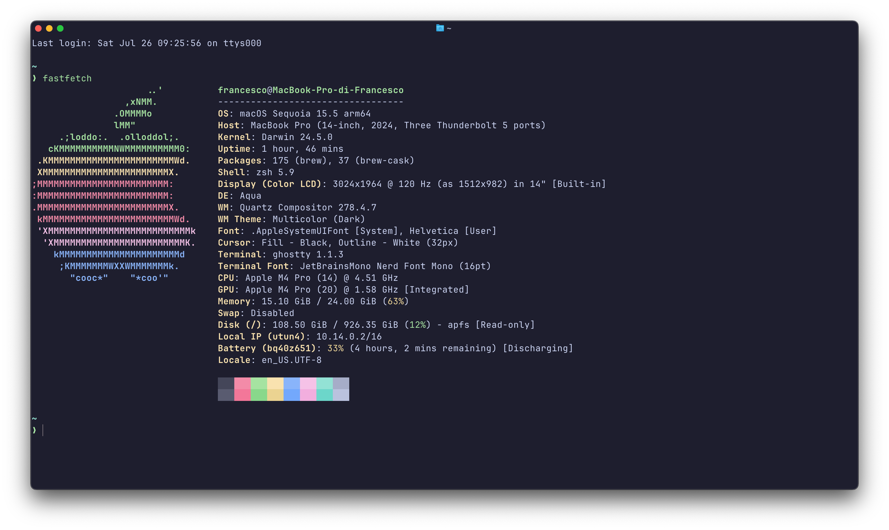

---

## 📁 ***My Dotfiles***

Personal configurations for a modern, productive, and minimal shell.
Meant to be used with my **.zshrc** on macOS.
This repository contains the configuration files I use daily on macOS/Linux, including:

- ⚡ **Zsh** with custom plugins and prompt, managed by Zinit
- 📝 **Neovim** as my favourite editor within the terminal
- 🪞 **Ghostty** as terminal emulator
- 🛠️ Other CLI tools (SDKMAN, fnm, Starship, etc.)
- 🍺 **Homebrew** package management via `Brewfile`  **([Homebrew Bundle, brew bundle and Brewfile](https://docs.brew.sh/Brew-Bundle-and-Brewfile))**

---

## 📸 **Terminal Preview**



---

## 🗂 **Repository Structure**

```bash
dotfiles/
├── Configs/                 # Dotfiles go here
│   ├── aerospace/           # Aerospace tiling manager
│   ├── environment/         # launchd plist for XDG_CONFIG_HOME (GUI apps)
│   ├── ghostty/             # Ghostty terminal
│   ├── nvim/                # Neovim editor
│   ├── nushell/             # Nushell
│   ├── proton-pass/         # Proton Pass CLI SSH agent launchd plist
│   ├── ssh/                 # SSH client config (~/.ssh/config)
│   ├── starship/            # Starship prompt
│   ├── yazi/                # Yazi file manager
│   ├── zellij/              # Zellij multiplexer
│   ├── zsh/                 # Zsh shell
│   └── ...                  # Other tool configs
├── Hooks/                   # Setup scripts go here (auto-run on `tuckr set`)
├── Secrets/                 # Encrypted files go here
└── brewfile                 # Homebrew packages
```

---

## 🚀 **Quick Setup**

### Prerequisites

Make sure you have installed:
- **Git**
- **Zsh**
- **Nushell**
- **Homebrew** (on macOS) or an equivalent package manager
- **Tuckr** for dotfiles management

### **Installation Steps**

1. Clone your dotfiles repository into a folder in your home directory:

    ```bash
    git clone https://github.com/fraluc06/dotfiles.git ~/.dotfiles
    ```
    or via SSH:

    ```bash
    git clone git@github.com:fraluc06/dotfiles.git ~/.dotfiles
    ```
   or via gh CLI:

    ```bash
    gh repo clone git@github.com:fraluc06/dotfiles.git ~/.dotfiles
    ```

2. Change into the dotfiles directory:

    ```bash
    cd ~/.dotfiles
    ```

3. Use **Tuckr** to symlink your configs automatically:

    ```bash
    tuckr zsh
    tuckr nvim
    tuckr ghostty
    # ...
    ```
    or all with one command

    ```bash
    tuckr */ # Everything (the '/' ignores the README)
    ```

    For the SSH + launchd setup (SSH client config, Proton Pass CLI SSH agent daemon, and `XDG_CONFIG_HOME` for GUI apps), run:

    ```bash
    tuckr set ssh proton-pass environment
    ```

    This symlinks the configs **and** runs the posthooks, which auto-bootstrap the launchd agents (`com.proton.pass-cli.ssh-agent` and `my.startup.shell_agnostic.environment`). No manual `launchctl` commands needed.

4. Install all Homebrew packages and casks from your `Brewfile`:

    ```bash
    brew bundle --file=~/dotfiles/Brewfile
    ```

5. Install npm packages from the JSON file (requires `jq`):
    ```bash
    bat npm-global-packages.json | jq -r '.dependencies | keys[]' | xargs npm install -g
    ```

---

## 📦 Exporting Packages

This section explains how to export the package lists for Homebrew and npm.

### Homebrew

To update the `Brewfile` with all currently installed packages, run:

```bash
brew bundle dump --file=./Brewfile --force
```

### NPM

To save a list of globally installed npm packages, run:

```bash
npm ls -g --json > npm-global-packages.json
```

---

## 🧩 **Included Plugins & Tools**

### **Zsh**
- Managed with `Zinit` for optimal plugin loading
- `zsh-autosuggestions`: Dynamic suggestions while typing
- `fzf-tab`: Replace zsh's default completion selection menu with fzf
- `fast-syntax-highlighting`: Syntax highlighting for commands
- `forgit` : A utility tool powered by fzf for using git interactively.

### **Nushell**
- The `XDG_CONFIG_HOME` environment plist for GUI apps is managed by the `environment` tuckr group. Deploy it with:

    ```bash
    tuckr set environment
    ```

    The posthook auto-loads `~/Library/LaunchAgents/environment.plist` into launchd (sets `XDG_CONFIG_HOME` for GUI apps at login).
- To set Nushell as default shell, run:

    ```bash
    chsh -s /opt/homebrew/bin/nu
    ```

    then reboot your machine.

### **Terminal**
- **Ghostty** with custom themes and fonts:
  - **[Catppuccin Mocha](https://github.com/catppuccin/)**: Catppuccin is a pastel theme with four warm flavors and 26 eye-candy colors, ideal for coding, designing, and other creative tasks.
  - **[JetBrains Mono Nerd Font](https://www.nerdfonts.com/font-downloads)**: A monospaced font with programming ligatures and Nerd Font glyphs for an enhanced coding experience

---

## 📜 **License**

MIT – Free to use, modify, and distribute with attribution.

---
